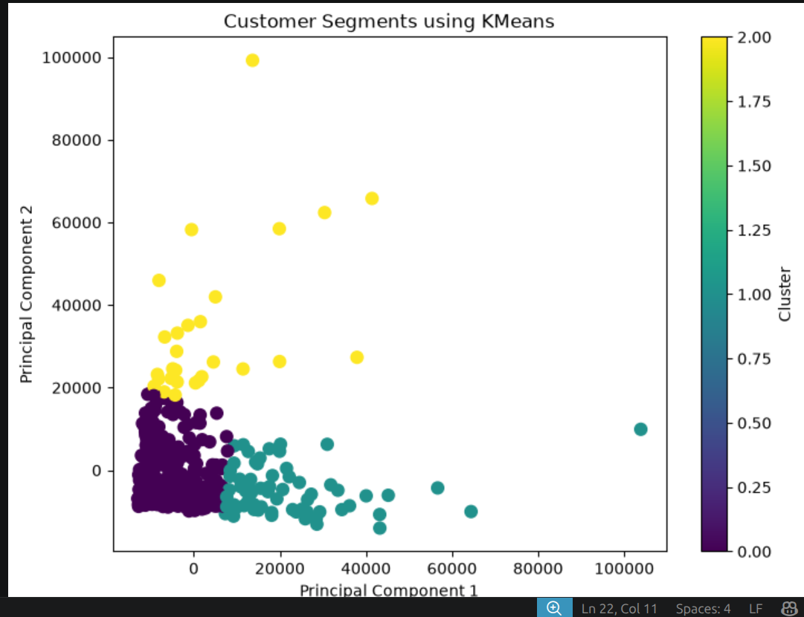
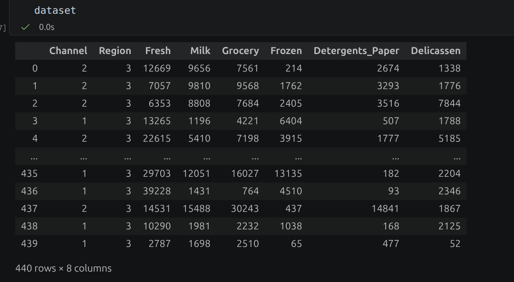

# 🛍️ Customer Segmentation using K-Means Clustering

## 📌 Project Overview

This project performs customer segmentation using the K-Means Clustering algorithm.

Customer segmentation helps businesses group customers based on purchasing behavior, allowing companies to design personalized marketing strategies.

---

## 📂 Dataset

Dataset:
Wholesale Customers Dataset

Features:

- Channel
- Region
- Fresh
- Milk
- Grocery
- Frozen
- Detergents_Paper
- Delicassen

Total Records: **440**

---

## 🛠 Technologies Used

- Python
- NumPy
- Pandas
- Matplotlib
- Scikit-Learn
- Jupyter Notebook

---

## 📊 Machine Learning Workflow

1. Import Libraries
2. Load Dataset
3. Data Preprocessing
4. Feature Scaling
5. Find Optimal K using Elbow Method
6. Train K-Means Model
7. Predict Customer Clusters
8. Evaluate using Silhouette Score
9. Visualize Customer Segments

---

## 📈 Evaluation

### Elbow Method

Used to determine the optimal number of clusters.

### Silhouette Score

Measures cluster quality.

Higher score indicates better clustering.

---

# 📊 Project Results

## 1. Feature Scaling


---

## 4. PCA Visualization



---

## 5. Model Features



## 🚀 How to Run

Clone the repository

```bash
git clone https://github.com/yourusername/Customer-Segmentation.git
```

Install dependencies

```bash
pip install -r requirements.txt
```

Run Jupyter Notebook

```bash
jupyter notebook
```

Open

```
Customer_Segment.ipynb
```

---

## 📚 Libraries Used

```python
import numpy as np
import pandas as pd
import matplotlib.pyplot as plt

from sklearn.preprocessing import StandardScaler
from sklearn.cluster import KMeans
from sklearn.metrics import silhouette_score
```

---

## 🎯 Learning Outcomes

- Data Preprocessing
- Feature Scaling
- K-Means Clustering
- K-Means++
- Elbow Method
- Inertia
- Silhouette Score
- Cluster Visualization
- Customer Segmentation

---

## 👨‍💻 Author

**Srinu**

GitHub:
https://github.com/246m1a1204-bilp
